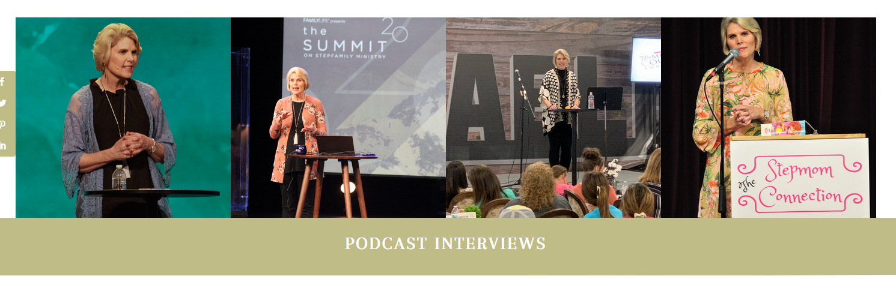

-form (need to learn still)

- animations for wording appearing

- about
  - fix your spacing bro

- speaking
  - hero optional? can use the same for now, but should consider other options
  - content block first - DONE
  - topics (from word doc) - DONE
  - endorsements (pull from current site) - DONE
  - replace the group panel pic with this:  - DONE
  
  - speaking TODO:
  - events (from word doc + current site)
  - women and blended family live stream (on youtube)
    - there's like 2 years of videos, 1 per month
    - need to describe what this is, and have a clean redirect
    - UPDATE: going to use a graphic for this

- books
    - 

- media
    - Podcasts
    - Video interviews

TOUCH UPS:
  testimonials:
    - consistent image sizes
    - use the same word spacing as Ron Deal's card (2/3 and 4/5 I think)